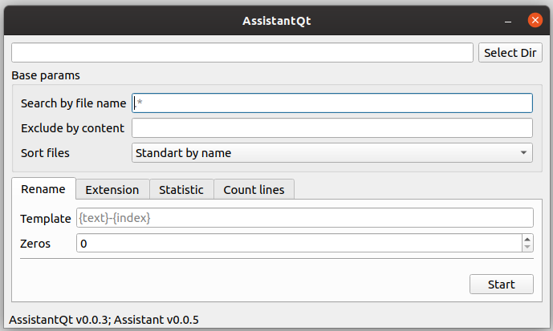

AssistantQt
===================

AssistantQt open source gui for console application Assistant.

Assistant
===================

Assistant is a delightful files mod tool.

#### Info:

* search file by name (regex)
* exclude file by content (regex)
* sort files - standard by name, natural by name, last modification file
* rename files in folder with index
* size zeros in index
* uppercase extension in folder
* lowercase extension in folder
* statistic - show about files info (count lines, max/min size, max/min lines, etc)
* lines - counting lines by search regex